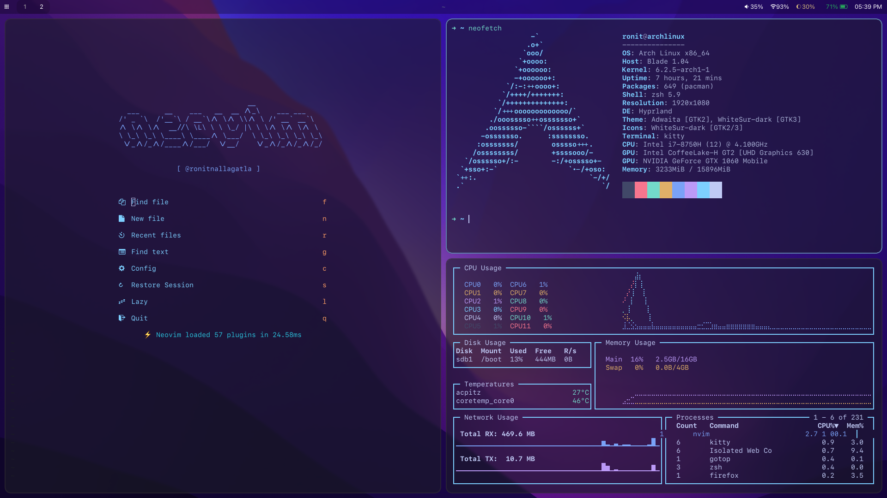

# dotfiles
Decided to get a basic Arch Linux setup going. I'm running it on a removable external SSD so that I can switch between Windows and Linux. It seems to be pretty stable so far. 

## Fetch

